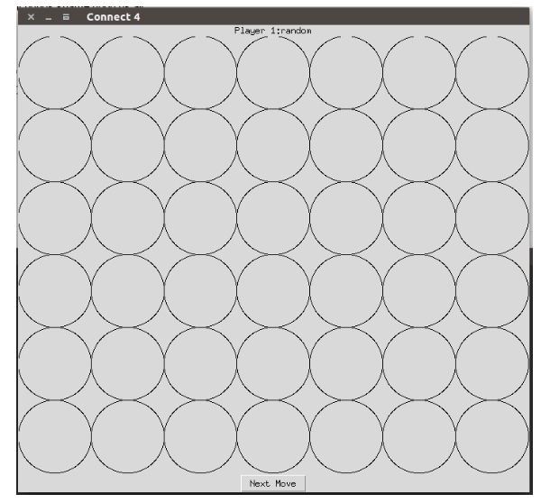
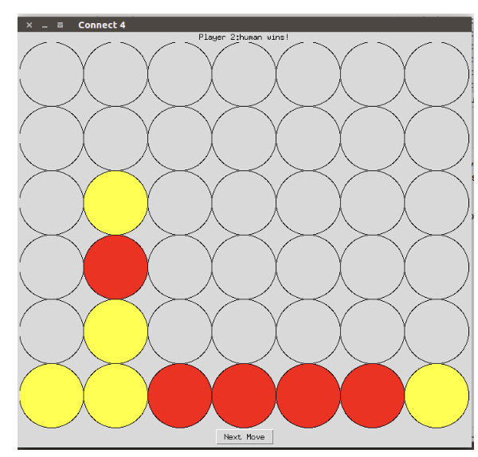

# Assignment2: Connect 4 Game

## Description
In this assignment you will implement an agent to play the game of Connect 4. Your agent will use the alpha-beta search algorithm and the expectimax search algorithm to select the next move given the current board state.

There are two main files:

* `ConnectFour.py`
* `Player.py`

ConnectFour.py contains the all of the functions of the game. Player.py contains all of the types of players that can participate in the game:

* AIPlayer (Your Implementation)
* RandomPlayer (Chooses from valid columns with equal probability) 
* HumanPlayer (You)

You need to implement **all** of the following functions **without importing additional modules**:

1. `def get_alpha_beta_move(self, board)`

	* Given the current state of the board, return the next move based on the alpha-beta pruning algorithm.
	* Input: a numpy array containing the state of the board, specified in the starter code.
	* Output: The 0 based index of the column that represents the next move.

2.  `def get_expectimax_move(self, board)`
	* Given the current state of the board, return the next move based on the expectimax algorithm.
	* Input: a numpy array containing the state of the board, specified in the starter code.
	* Output: The 0 based index of the column that
            represents the next move.
3.  `def evaluation_value(self, board)`
	* Given the current stat of the board, return the scalar value that represents the evaluation function for the current player.
	* Input: a numpy array containing the state of the board, specified in the starter code.
	* Output: The utility value for the current board

These functions serve as a high level abstraction for interacting with a player. You will likely need to implement other functions in the class to make your code modular and readable. **Note that it will likely be too expensive to explore the entire game tree at the beginning of the game so a depth-limited search is a good place to start.**

To play the game you need to run `python ConnectFour.py arg1 arg2` where arg1 and arg2 are one of AI, random, or human.

For example if you wanted to play against a random player you would run `python ConnectFour.py human random`

If you wanted your AI to play itself you would run `python ConnectFour.py ai ai`.  `ConnectFour.py` takes one optional argument `--time` that is an integer. It is the value used to limit the amount of time in seconds to wait for the AI player to make a move. The default value is 60 seconds.
**Note: A human player has to enter their move into the terminal.

Here is the award winning GUI that comes included:

The top text displays the player who's move it is. The well drawn circles in the middle are the places places on the game board.
The next move button does exactly what you expect, it moves the game forward by one move. When the game is over the top text will change to the name of the winning player and 'wins!' Shown below is an example where I managed to get the best of a Random player:

## Deliverables
You will turn in 2 files on **Canvas** in one compressed folder (e.g., zip file).  

1. `Player.py`: this should include your alpha-beta search algorithm and expectimax search implementations in the `AIPlayer` class
2. Assignment.pdf: addresses the following questions:
	1. What heuristic did you use? Why?
	2. Describe how your algorithm performs given different time constraints. How
much of the tree can you explore given 5 seconds per turn? 10 seconds? 3 seconds?
	3. Can you beat your algorithm?
	4. If your algorithm plays itself, does the player that goes first do better or worse in general? Share some of the results.